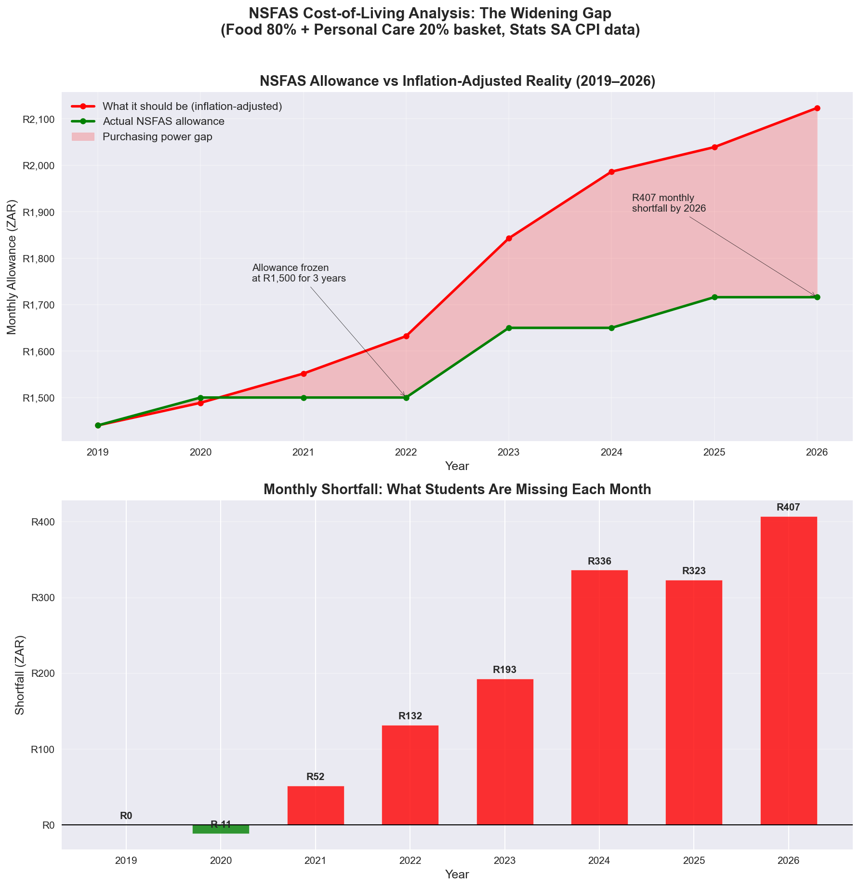
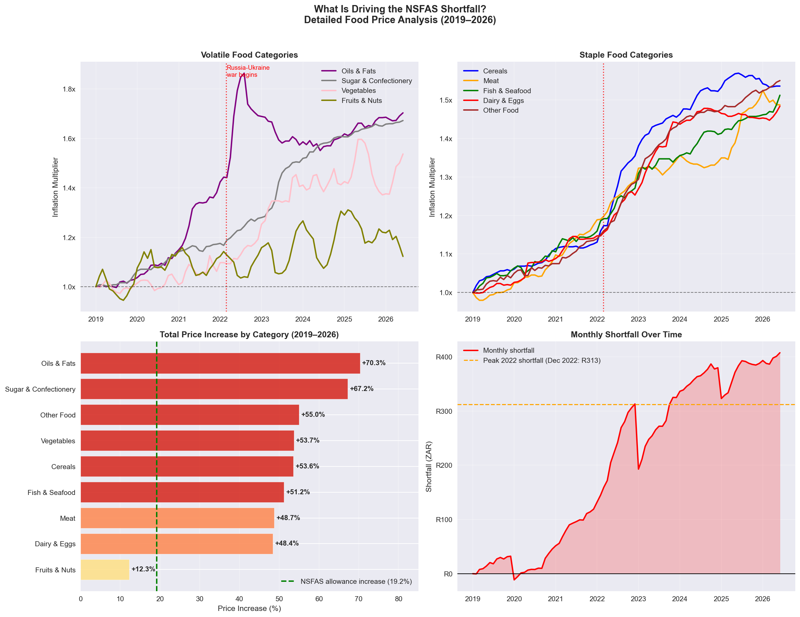

# NSFAS Cost-of-Living Analyser

A data-driven analysis of whether the NSFAS monthly living allowance has kept pace with the real cost of living for South African students between 2019 and 2026, using official Stats SA Consumer Price Index (CPI) data.



> **Disclaimer:** This project is an independent academic and portfolio analysis. It is not affiliated with, endorsed by, or representative of NSFAS, Stats SA, or any university. The findings are based on publicly available data and a simplified student basket model. They are intended to inform and provoke thoughtful discussion — not to assign blame or make political statements. All data sources are cited and the analysis is fully reproducible from the notebook.

---

## The Problem

Approximately 900,000 South African students depend on the NSFAS living allowance to cover food, toiletries, and basic personal maintenance each month. As of 2025–2026, that allowance stands at R1,716 per month (R17,160 paid over 10 months) for university students in non-catered accommodation.

The question this project asks is simple: **is R1,716 enough?**

Not based on opinion. Not based on social media posts. Based on data — the same CPI data Stats SA uses to measure inflation across South Africa every month.

---

## Data Sources

- **Stats SA CPI (COICOP) Historical Data** — Monthly consumer price indices from January 2008 to June 2026, covering all 11 official CPI categories and sub-categories for Total country. Published as `P0141`. Available at [statssa.gov.za](https://www.statssa.gov.za)
- **NSFAS allowance history (2019–2026)** — Compiled from FundiConnect NSFAS allowance breakdown ([fundiconnect.co.za/nsfas-allowances-breakdown](https://fundiconnect.co.za/nsfas-allowances-breakdown)) and corroborated by the author, an active NSFAS beneficiary at a South African university. The R1,716/month figure represents the 2025–2026 living allowance for university students in non-catered accommodation (R17,160 annual, paid over 10 months).

---

## Student Profile

This analysis models a **university student in non-catered accommodation** — the most common NSFAS student type. For this student:

- The living allowance covers both food and personal care
- Transport is funded separately and excluded from this analysis
- Data/airtime is excluded as campus and residence wifi is widely available

---

## Student Basket Model

The basket is weighted as follows:

| Category | CPI Code | Weight | Rationale |
|---|---|---|---|
| Food and non-alcoholic beverages | CPT01000 | 80% | Dominant cost — meals and groceries |
| Personal care | CPT13100 | 20% | Toiletries and hygiene products |

**Base year: January 2019.** The 2019 allowance of R1,440/month is used as the starting point. The inflation-adjusted allowance shows what R1,440 should be worth in each subsequent year if it had kept pace with actual price increases.

**Important caveat:** This analysis assumes the 2019 allowance was adequate as a baseline. If the 2019 allowance was already insufficient, the shortfall figures below understate the true gap. This is an acknowledged limitation of any index-based approach.

---

## Methodology

### 1. CPI Index Extraction
Monthly CPI index values extracted for Food (CPT01000) and Personal Care (CPT13100) categories, Total country, from the Stats SA P0141 dataset. Stats SA's base period is December 2024 = 100. This analysis rebases to January 2019 = 1.0 for comparison purposes — these are two different reference points and should not be confused.

### 2. Inflation Multipliers
Each month's index divided by the January 2019 base value to produce a multiplier showing cumulative price growth since 2019.

### 3. Inflation-Adjusted Allowance
The 2019 allowance of R1,440 multiplied by the weighted basket multiplier each year:

`Adjusted = R1,440 × (0.80 × Food_multiplier + 0.20 × PersonalCare_multiplier)`

### 4. Shortfall Calculation
`Shortfall = Inflation_Adjusted_Allowance − Actual_NSFAS_Allowance`

A positive shortfall means the actual allowance falls below what inflation would require.

### 5. Annual vs Monthly Comparison
Annual figures use January of each year as the reference month. However, monthly shortfalls are also computed across the full time series to identify peak shortfall periods — January snapshots can materially understate the worst months, as demonstrated by the 2022 finding below.

### 6. Food Sub-Category Analysis
Nine food sub-categories extracted and analysed independently to identify which specific items are driving the gap.

---

## Key Findings

### The Allowance Has Not Kept Pace With Inflation

| Year | Actual Allowance | Inflation-Adjusted | Monthly Shortfall |
|------|-----------------|-------------------|-------------------|
| 2019 | R1,440 | R1,440 | R0 |
| 2020 | R1,500 | R1,489 | -R11 (overpaid) |
| 2021 | R1,500 | R1,552 | R52 |
| 2022 | R1,500 | R1,632 | R132 |
| 2023 | R1,650 | R1,843 | R193 |
| 2024 | R1,650 | R1,986 | R336 |
| 2025 | R1,716 | R2,039 | R323 |
| 2026 | R1,716 | R2,123 | R407 |

**The allowance grew 19.2% between 2019 and 2026. Food prices grew 51.3% over the same period.**

### January Figures Understate the Worst Months

The annual shortfall table uses January of each year as the reference point. Monthly analysis reveals the true severity is consistently worse:

- **January 2022 shortfall: R132** — what the annual table shows
- **December 2022 shortfall: R313** — the actual worst month of 2022, more than double the January figure
- **June 2026 shortfall: R407** — the current and all-time peak

The 2022 gap between January and December is explained by the Russia-Ukraine war beginning in February 2022, which drove a sharp spike in Oils & Fats prices mid-year that had partially subsided by the following January — but never fully recovered.

### What Is Driving the Gap



Price increases by food sub-category (2019–2026):

| Category | Price Increase | Student Impact |
|---|---|---|
| Oils & Fats | +70.3% | Cooking oil — spiked sharply in 2022, never recovered |
| Sugar & Confectionery | +67.2% | Jam, peanut butter — cheap calorie staples |
| Other Food | +55.0% | Mixed staples |
| Vegetables | +53.7% | Load shedding destroyed cold storage and raised transport costs |
| Cereals | +53.6% | Maize meal, bread, rice, pasta — backbone of a student diet |
| Fish & Seafood | +51.2% | Tinned fish — affordable protein source |
| Meat | +48.7% | Chicken, mince — protein |
| Dairy & Eggs | +48.4% | Eggs especially — cheap, versatile protein |
| Fruits & Nuts | +12.3% | Most contained category — and first to be cut from student diets |

Every food sub-category except Fruits & Nuts has outpaced the 19.2% allowance increase. The backbone of a student diet — cereals, vegetables, eggs, tinned fish — has become 50%+ more expensive while the allowance grew by less than 20%.

### The 2022–2023 Inflection Point
The most damaging period for students was 2022–2023, when the allowance was frozen at R1,500 for three consecutive years while almost every food category accelerated simultaneously. The Russia-Ukraine war (February 2022) drove a sharp spike in Oils & Fats that cascaded through the food system. Load shedding simultaneously raised production and transport costs for vegetables and processed foods.

---

## Limitations

- **Baseline assumption** — the analysis assumes the January 2019 allowance (R1,440) was adequate. If it was already insufficient, shortfall figures are understated.
- **Simplified basket** — the 80/20 food/personal care split is an approximation based on the structure of the NSFAS allowance. Individual student spending patterns vary by institution, location, and dietary needs. No student expenditure survey data was available to empirically validate the weighting.
- **National averages** — CPI is a national average. Food prices in urban areas (Johannesburg, Cape Town) tend to be higher than the national index, meaning the shortfall may be understated for students at universities in major cities.
- **No accommodation costs** — rent and utilities are excluded as these are covered separately in the NSFAS allowance structure.
- **January reference month** — annual figures use January of each year. As demonstrated by the 2022 finding, this can materially understate peak shortfalls. Monthly figures are available in the notebook.
- **Allowance variation by student type** — amounts vary by accommodation type (catered vs non-catered), institution, and disability status. This analysis models university students in non-catered accommodation specifically.

---

## Stack

- **Python** — `pandas`, `numpy`, `matplotlib`, `seaborn`
- **Data** — Stats SA CPI P0141 (publicly available)
- **Environment** — Jupyter Notebook

---

## Repository Structure

```
nsfas-cost-of-living/
│
├── nsfas_analysis.ipynb          # Full analysis — data pipeline through visualisations
├── CPI_data_2008-2026.xlsx       # Stats SA CPI source data (P0141)
├── nsfas_analysis.png            # Hero chart — gap analysis
├── nsfas_subcategory.png         # Sub-category breakdown
└── README.md
```

---

## Author

BSc Computer Science & Statistics, University of Zululand
GitHub: [MikeyZayn](https://github.com/MikeyZayn)
